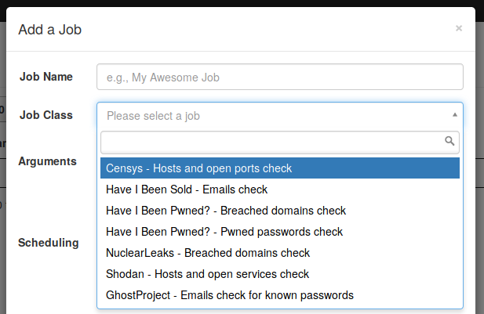
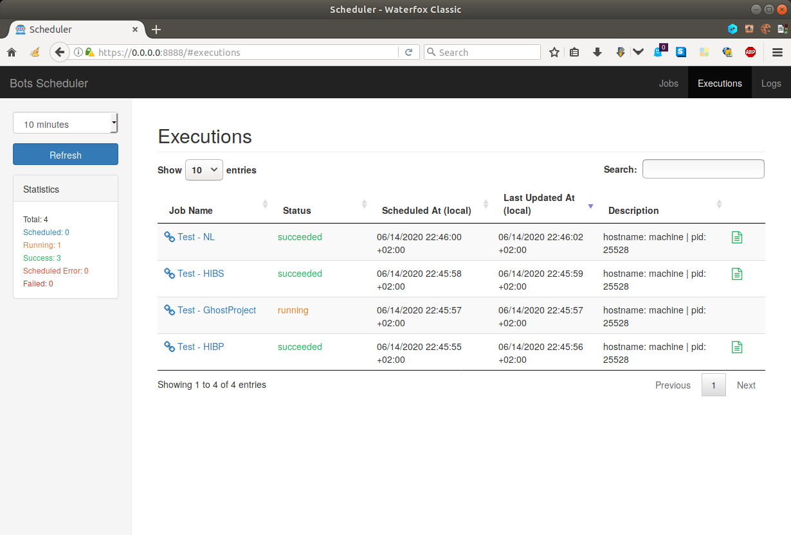
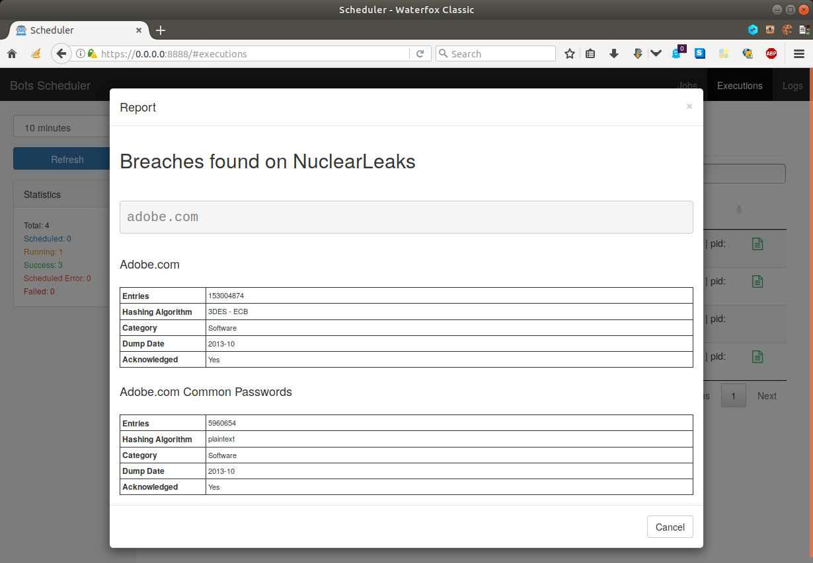

!!! note "This page is for developers"
    
    This page explains how to create new jobs for integration into the project. It is aimed to show to a developer some steps to successfully make a new job.
    
    If you want sysadmin-oriented information, please consult [the related page](server.html). For user-oriented information, please consult [the other related page](jobs.html).

-----

## Overview

The plugin architecture of this project relies on the jobs folder(s), configurable through the `--jobs` option of the *basic options* (see [the *Server tuning* section](sever.html)). These jobs folders are Python packages to be imported by the main application.

```sh
$ ./bots-scheduler run [...] --jobs my-jobs-folder --jobs my-other-jobs-folder
```

## Jobs folder

A folder with job class definitions is structured as follows:

```
jobs/
+-- __init__.py
+-- _base.py
+-- ... (custom job files)
```

In this project, the API for job class' definition is slightly enhanced regarding [NdScheduler](https://github.com/Nextdoor/ndscheduler) for the sake of simplicity. This is reflected in `_base.py`, hence this file must be copied into a new folder with job class definitions (unless you want to use `ndscheduler.job.JobBase` directly).

## Job class template

On the contrary of [NdScheduler](https://github.com/Nextdoor/ndscheduler), in this project, `ndscheduler.job.JobBase` can be subclassed as many times as needed without having each proxy class being captured as a usable job class. In other words, only leaf job classes in the inheritance tree are loaded.

The following snippet shows a job class template:

```python
from ._base import *

class TestJob(JobBase):
    info = {
        'job_class_name':    "This will be displayed as the job class name",
        'notes':             "This will do something",
        'arguments':         [],
        'example_arguments': "",
        'report_title':      "An example report",
        'enabled':           True,
    }

    @report
    def run(self, *args, **kwargs):
        # do something
        # compute report_items here
        return item1, item2, ...
```

In this template, we notice:

- The wildcard import from `_base.py`, required for the `JobBase` and report object classes.
- The job metadata in the `info` dictionary, holding job's information for display in the WUI.
- The `run` method, decorated with the `report` decorator, returning a list of report objects.

For the job information, note that:

- `job_class_name` is displayed in the dropdown list when adding or modifying a job. Beware of name clashes as multiple classes can be defined at different locations, thus having a unique job class string (e.g. `shell.ShellCommand` and `myjob.ShellCommand`) while being displayed as the same name in the WUI.
- `arguments` is a list of dictionaries, one per argument, with the `type` and `description` fields. These are displayed in the WUI as help when adding or modifying a job.
- `report_title` holds a static report title but can be omitted if the first return value of the `run` method is itself a title report object.
- `enabled` is `True` by default for any job class. It can thus be omitted for enabled jobs but must be included for disabling one (e.g. `shell.RawShellCommand`).

!!! note "Jobs visibility"
    
    A job that has its `enabled` property set to `False` will not be visible at all in the WUI, that is, in the *Jobs* section but in the *Executions* and *Logs* sections as well.
    
    <p align="center"><table><tbody><tr><td>
    
    In this example, job executions and related audit logs will be viewable.
    </td><td>
    
    In this example, job executions and related audit logs will NOT be viewable.
    </td></tr></tbody></table></p>

## Report objects

As mentioned before, report objects can be used to tune report's layout to be displayed for an execution in the WUI. The following screenshot shows where a report is generated and how it looks like.

<p align="center"><table><tbody><tr><td>

</td><td>

</td></tr></tbody></table></p>

A report is an assembly of objects from [Tinyscript](https://github.com/dhondta/tinyscript)'s report feature. For a complete list of report objects and more, please refer to [this documentation](https://python-tinyscript.readthedocs.io/en/latest/reporting.html). The most relevant report object classes in this project are:

**Class** | **HTML tag** | **Description**
--- | --- | ---
`Code(c)` | `pre` | Code block, taking 1 argument: the [c]ode
`Data(d)` |  | Data [d]ictionary ; its HTML is generated using [json2html](https://pypi.org/project/json2html/)
`Image(s,d,w,h)` | `img` | Image reference, taking up to 4 arguments: the [s]ource and optionally a [d]escription, the [w]idth and the [h]eight
`List(*i)` | `ol`, `ul` | List of [i]tems that can be ordered or not
`Table(d,ch,rh,cf)` | `table` | Table with column and row headers, taking 3 arguments : a list of rows as the [d]ata, a list of [c]olumn [h]eaders, a list of [r]ow [h]eaders and a list of [c]olumn [f]ooters
`Text(c,t)` | `p` | Text paragraph, taking 1 argument : the [c]ontent to be displayed as a paragraph or any user-defined [t]ag
`Section(t)` | `h2` | Bold section title line, taking 1 argument : section title's [t]ext
`Subsection(t)` | `h3` | Bold section title line, taking 1 argument : subsection title's [t]ext

By convention, the available jobs use the `Section` object class for their report title. For instance, in the case of `haveibeenpwned.PwnedPasswordsJob`, the return list of the `run` method holding the report objects simply consist of:

```
Section("Pwned passwords found on HaveIBeenPwned?")
List(*list_of_pwned_passwords)
```

!!! note "Report object nesting"
    
    Report objects can be nested, e.g. `Table([[img, Data(d)]])`.

Another interesting example is this of `ghostproject.GhostProjectJob`:

```
Section("Email addresses with known passwords found on GhostProject")
Data(result)
```

The robot getting the pwned passwords per email address formats it as a dictionary, suitable for use with the `Data` report object, hence the simplicity in its definition as here before.

## Robot classes

Defining a job class is one issue, writing robot classes in [PyBots](https://github.com/dhondta/python-pybots) is another. Of course, the `run` method can always contain machinery to perform complex network communication tasks, but [PyBots](https://github.com/dhondta/python-pybots) is aimed at standardizing the way robots are made and used through context managers. If you would like to get a new robot implemented for use in a Bots Scheduler job, please [submit an enhancement issue](https://github.com/dhondta/python-pybots/issues/new) or implement it yourself, preferably [sending a pull request](https://github.com/dhondta/python-pybots/pulls) for incrementing the library.

The way robots from [PyBots](https://github.com/dhondta/python-pybots) can be used is particularly convenient for sparing lines of code in job class definitions. For instance, `nuclearleaks.NuclearLeaksJob`'s `run` method starts with:

```python
@report
def run(self, emails_domains_path, **kwargs):
    with NuclearLeaksBot() as bot:
        results = bot.breaches_from_file(emails_domains_path)
    [...]
```

The whole work is done by the `NuclearLeaksBot` that exposes a very simple interface for getting its result.

Another example is `shodan.ShodanHostsCheckJob` that calls `ShodanBot`, itself relying on `ShodanAPI` that implements the full API as of [this documentation](https://developer.shodan.io/api).

