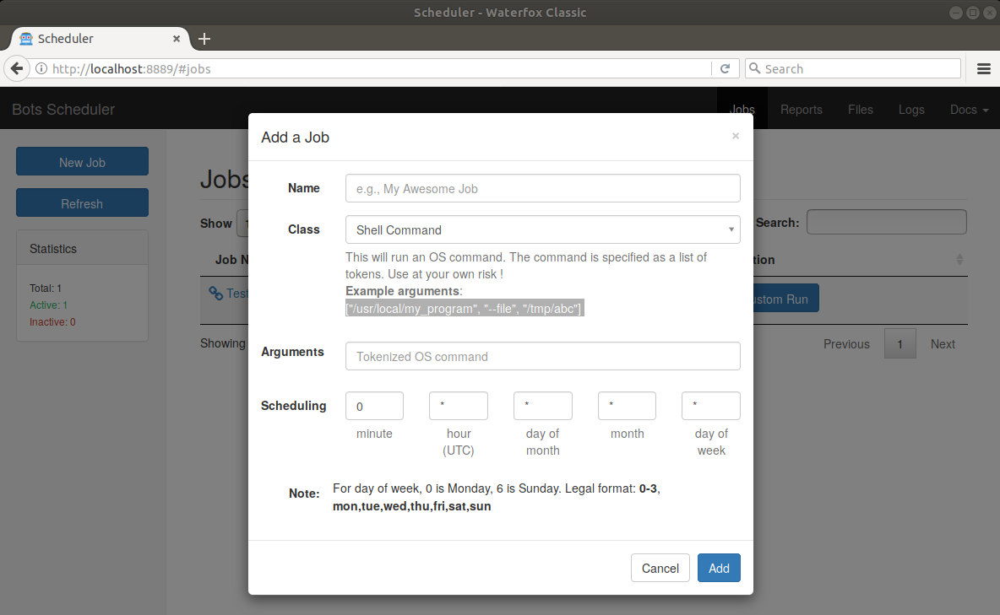
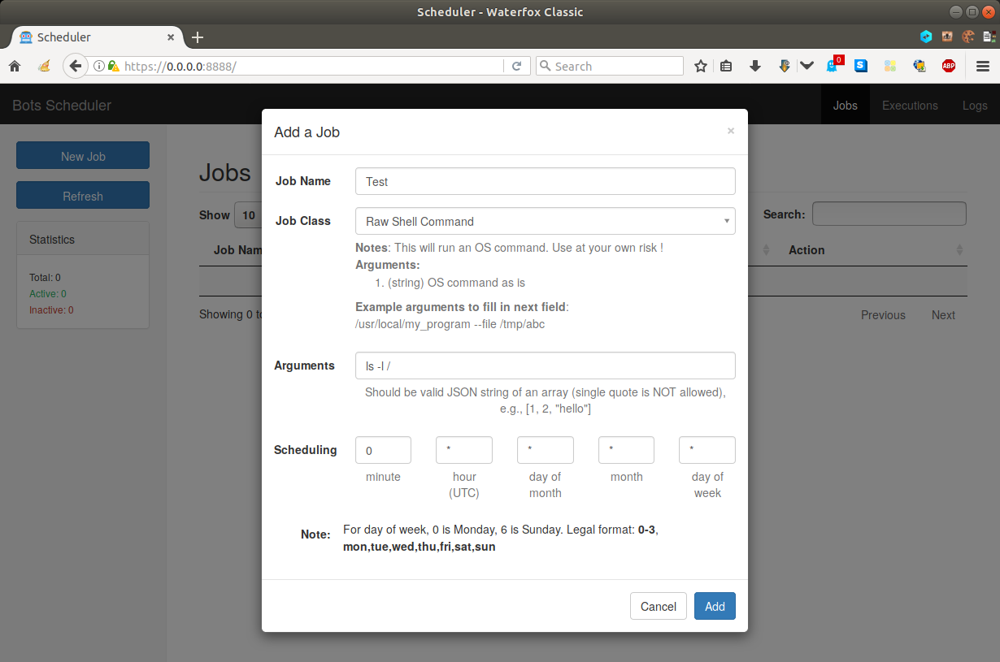
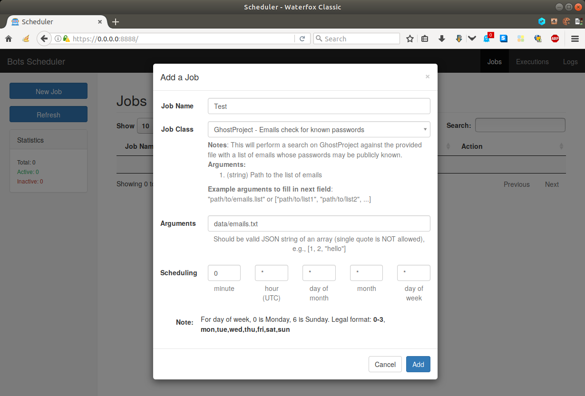
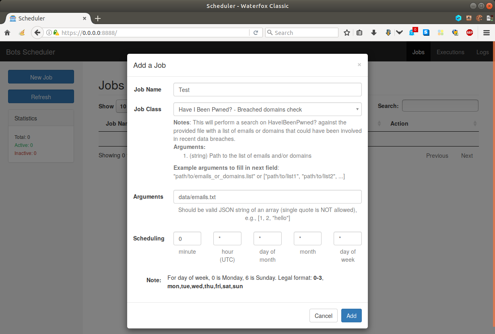
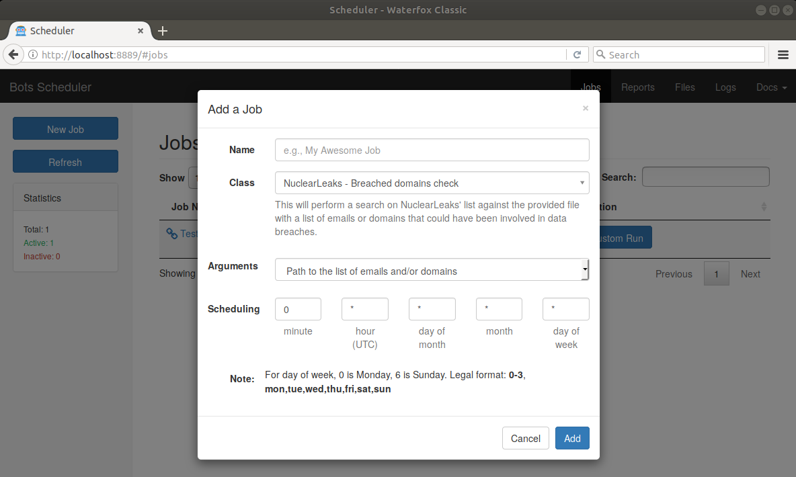
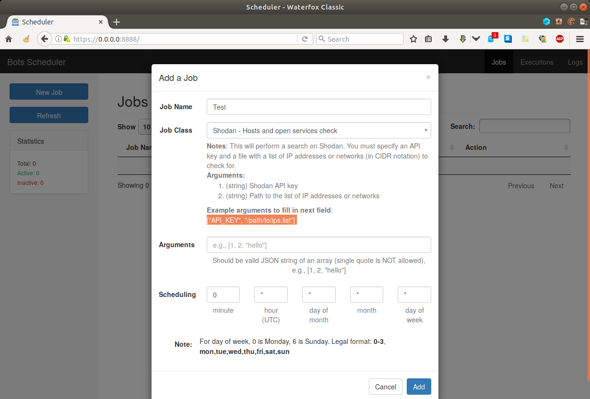

!!! note "This page is for users"
    
    This page presents the available jobs and their parameters. It is aimed to show to a user of the WUI how to use these jobs.
    
    If you want sysadmin-oriented information, please consult [the related page](server.html). For developer-oriented information, please consult [the other related page](howto.html).

-----

## Shell

!!! danger "Not enabled by default"
    
    Due to the obvious dangerousness of letting a user trigger OS commands, the following jobs are **disabled by default**. These can be enabled by editing the jobs and setting the `info` key `enabled` to `True`.

This module contains two jobs:

- *Shell Command*: It runs an OS command tokenized into a list of arguments.

- *Raw Shell Command*: It runs a raw OS command.

-----

## Censys

This module contains one job:

- *Censys - Hosts and open ports check*: It checks a list of IP addresses and networks (in CIDR notation) for publicly accessible ports.

!!! warning "API ID and secret required"
    
    This job requires that you subscribe on [Censys](https://censys.io/) and that you ask for an API identifier and secret.

## GhostProject

This module contains one job:

- *GhostProject - Emails check for known passwords*: It checks a list of email addresses for publicly associated passwords.

## Have I Been Pwned?

This module contains two jobs:

- *Have I Been Pwned? - Breached domains check*: It checks a list of email addresses or domains for known data breaches (having leaked addresses and passwords).

- *Have I Been Pwned? - Pwned passwords check*: It checks a list of passwords for publicly known ones.

!!! note "k-Anonymity"
    
    This [service](https://haveibeenpwned.com/API/v3#PwnedPasswords) uses [k-anonymity](https://www.troyhunt.com/ive-just-launched-pwned-passwords-version-2/) to preserve privacy and prevent linking submitted passwords by only using the first 5 characters of the SHA1 hash.

## Have I Been Sold?

This module contains one job:

- *Have I Been Sold - Emails check*: It checks a list of email addresses against a database of publicly sold emails (e.g. for advertising).

## Nuclear Leaks

This module contains one job:

- *NuclearLeaks - Breached domains check*: It checks a list of domains for known data breaches (having leaked addresses and passwords).

## Shodan

This module contains one job:

- *Shodan - Hosts and open services check*: It checks a list of IP addresses and networks (in CIDR notation) for publicly accessible services. It is more detailed than the job *Censys - Hosts and open ports check*.

!!! warning "API key required"
    
    This job requires that you subscribe on [Shodan](https://shodan.io/) and that you purchase an API key.

